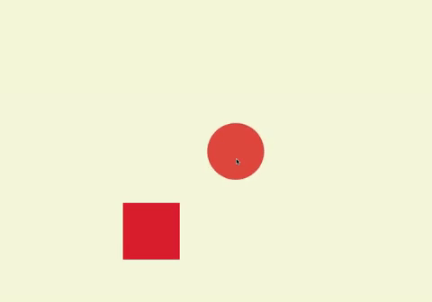

### Draginertia

> Hello! Welcome to the DragInertia Library. I created this library to be able to drag objects and apply inertia to them when they're dropped. I hope you enjoy it!

[](https://www.npmjs.com/package/draginertia) [](https://standardjs.com)

## Install

```bash
npm install --save draginertia
```

## Usage

```jsx
import React from 'react'

import DragInertia from 'draginertia'

class Example extends React.Component {
  render() {
    return (
        <>
        <DragInertia inertiaPower={4}><div className="redSquare"></div></DragInertia>
        <DragInertia inertiaPower={2}><div className="tomatoSquare"></div></DragInertia>

        </>
    )
  }
}
```
## DEMO



## Details

-You can use DragInertia by inserting your draggable object inside the tags as shown above.

-You can set the **inertiaPower**;
   - **inertiaPower={1}**, 1 being the lowest possible inertia applied to the object .
   - **inertiaPower={5}**, 5 being the highest possible inertia applied to the object.
   - If no entries, by **default** inertiaPower will be taken as **1**.

-DragInertia is set to **position:absolute** by default to be able to use left and top positioning.

I hope you enjoy it! :)
## License

MIT © [https://github.com/empipower6](https://github.com/https://github.com/empipower6)
